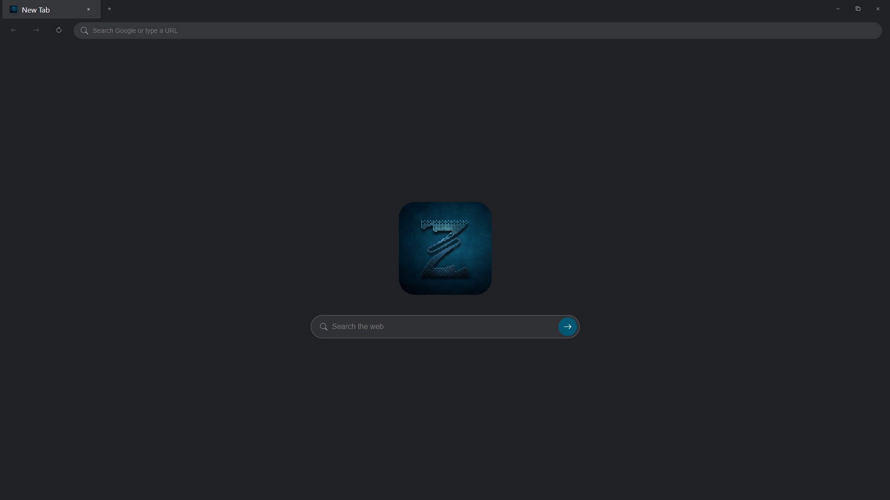
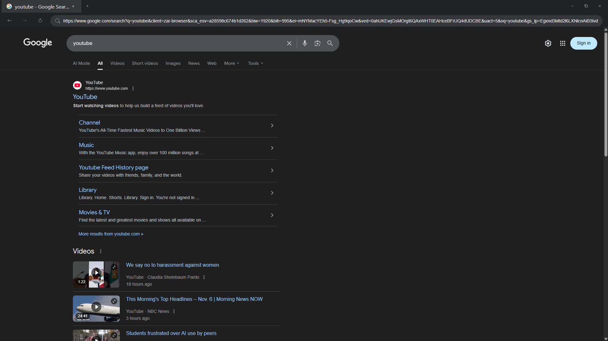
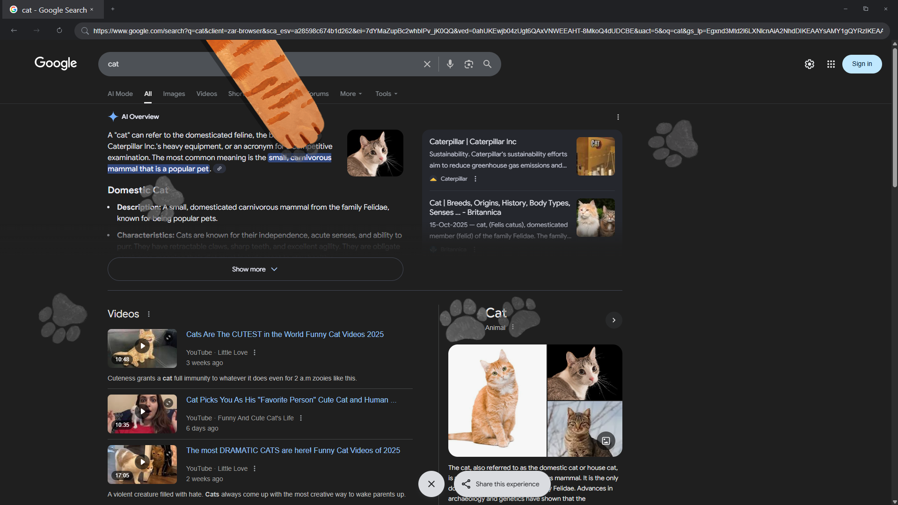

# Zar Browser

A lightweight and fast web browser built with Electron.

## Features

*   **Tabbed browsing:** Open multiple tabs to browse different websites simultaneously.
*   **Navigation:** Easily navigate back and forward, and reload pages.
*   **Home:** A dedicated home button to take you to your favorite page.
*   **Search:** A search bar to quickly find what you're looking for.
*   **Window Controls:** Standard window controls for minimizing, maximizing, and closing the browser.

## Screenshots





---

# [⬇️ Download Zar Browser (zip)](https://github.com/ZarScape/ZarBrowser/releases/latest/download/ZarBrowserSetup.zip)
# [⬇️ Download Zar Browser Setup](https://github.com/ZarScape/ZarBrowser/releases/latest/download/ZarBrowserSetup.exe)

---

## Getting Started (To run the app source code)

To get a local copy up and running, follow these simple steps.

### Prerequisites

*   Node.js and npm
    ```sh
    npm install -g npm
    ```

### Installation

1.  Clone the repo
    ```sh
    git clone https://github.com/ZarScape/ZarBrowser.git
    ```
2.  Install NPM packages
    ```sh
    npm install
    ```

### Running the App

```sh
npm start
```

## Built With

*   [Electron](https://www.electronjs.org/)
*   HTML
*   CSS
*   JavaScript

## License

Distributed under the MIT License. See `LICENSE` for more information.